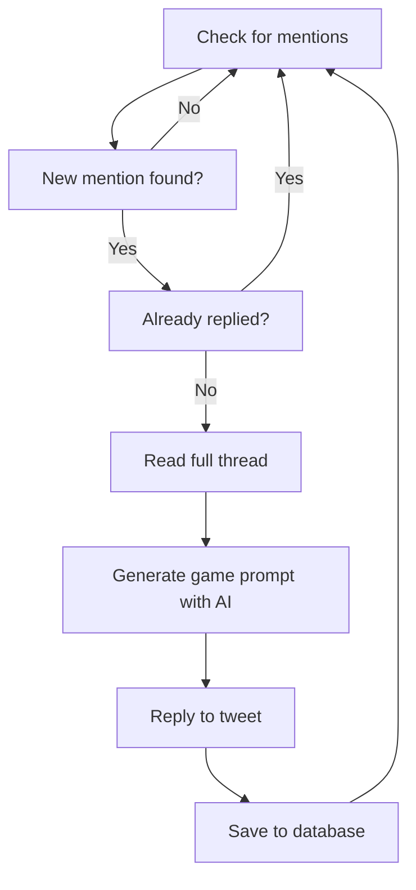

# 🤖 Rosebud X Bot

An intelligent Twitter/X bot that generates creative game prompts when tagged in conversations. Built with Node.js, Twitter API v2, and Google Gemini.

## 🌟 What It Does

When someone tags your bot in a Twitter thread, Rosie:
1. **Reads the entire conversation thread** for context
2. **Analyzes the discussion** using AI 
3. **Generates a creative game prompt** related to the conversation
4. **Replies with an engaging game** that encourages interaction

## 🎮 Example Interactions

**Thread about pizza:**
```
User 1: "Just had amazing pizza! 🍕"
User 2: "Pepperoni is the best!"
User 3: "@RosieBot what do you think?"

RosieBot: "🎮 GAME TIME! Based on your pizza chat... 
Would you rather: Only eat pizza with pineapple forever 
OR never have pizza again? Reply with your choice! 🍍"
```

**Thread about coding:**
```
User 1: "Struggling with React state management"
User 2: "@RosieBot help us out!"

RosieBot: "🌟 Let's play! I see you're discussing React...
Quick scenario: You're debugging code at 3AM and your 
coffee maker breaks. What's your survival strategy? ☕"
```

## 🚀 Quick Start

### Prerequisites
- Node.js 18+ installed
- Twitter Developer Account
- Google AI Studio Account (for Gemini API)

### 1. Clone and Install
```bash
git clone <your-repo>
cd rosebud-x-bot
npm install
```

### 2. Set Up Environment Variables
```bash
# Copy the example file
cp env.example .env

# Edit .env with your API keys (see setup guide below)
```

### 3. Test Your Setup
```bash
# Run tests to verify everything works
npm test
```

### 4. Start the Bot
```bash
# Development mode (with auto-restart)
npm run dev

# Production mode
npm start
```

## 🔧 Detailed Setup Guide

### Twitter Developer Account Setup

1. **Apply for Twitter Developer Access**
   - Go to [developer.twitter.com](https://developer.twitter.com)
   - Apply for Essential access (free tier)
   - Wait for approval (usually 1-2 days)

2. **Create a Twitter App**
   - Create new app in developer portal
   - Enable "Read and Write" permissions
   - Generate API keys and tokens

3. **Get Your Credentials**
   ```
   API Key (Consumer Key)
   API Secret (Consumer Secret)
   Access Token
   Access Token Secret
   Bearer Token
   ```

### Google Gemini Setup

1. **Get API Key**
   - Visit [Google AI Studio](https://makersuite.google.com/app/apikey)
   - Sign in with your Google account
   - Create a new API key
   - Copy the API key for your .env file

### Environment Configuration

Edit your `.env` file:
```env
# Twitter/X API Credentials
TWITTER_API_KEY=your_api_key_here
TWITTER_API_SECRET=your_api_secret_here
TWITTER_ACCESS_TOKEN=your_access_token_here
TWITTER_ACCESS_TOKEN_SECRET=your_access_token_secret_here
TWITTER_BEARER_TOKEN=your_bearer_token_here

# Google Gemini API Key
GEMINI_API_KEY=your_gemini_api_key_here

# Bot Configuration
BOT_USERNAME=YourBotUsername
POLL_INTERVAL_MINUTES=5
MAX_THREAD_LENGTH=10
```

## 📁 Project Structure

```
rosebud-x-bot/
├── src/
│   ├── bot.js           # Main bot logic
│   ├── ai-service.js    # OpenAI integration
│   ├── thread-reader.js # Twitter thread parsing
│   ├── persistence.js   # Database/logging
│   └── test.js         # Testing utilities
├── data/               # Bot data storage
├── package.json        # Dependencies
├── env.example        # Environment template
└── README.md          # This file
```

## 🧠 How It Works

### Core Components

1. **Bot Controller (`bot.js`)**
   - Polls Twitter for mentions every 5 minutes
   - Coordinates all other components
   - Handles errors and logging

2. **Thread Reader (`thread-reader.js`)**
   - Fetches entire conversation threads
   - Cleans and processes tweet data
   - Provides context to AI

3. **AI Service (`ai-service.js`)**
   - Sends thread context to Google Gemini
   - Generates creative game prompts using Gemini-1.5-flash
   - Handles fallbacks if AI fails

4. **Persistence (`persistence.js`)**
   - Tracks which tweets we've replied to
   - Prevents duplicate responses
   - Stores bot statistics

### The Bot Workflow



## 🎯 Game Types

The bot can generate various types of games:

- **Would You Rather** - Choice-based scenarios
- **Creative Writing** - Story prompts and challenges  
- **Trivia Questions** - Knowledge-based games
- **Hypothetical Scenarios** - "What would you do?" situations
- **Role-Playing** - Character-based interactions
- **Quick Polls** - Opinion-based questions
- **Word Games** - Language and creativity challenges

## 🛠️ Testing

### Run All Tests
```bash
npm test
```

### Test Individual Components
```bash
node src/test.js
```

The test suite checks:
- ✅ Environment variables
- ✅ Text cleaning functions
- ✅ Thread formatting
- ✅ Persistence system
- ✅ AI service (if API key provided)

## 📊 Monitoring

### View Bot Statistics
```javascript
const { getStats } = require('./src/persistence');
getStats().then(console.log);
```

### Check Recent Activity
```javascript
const { getRecentReplies } = require('./src/persistence');
getRecentReplies(10).then(console.log);
```

## 🚀 Deployment Options

### Replit (Recommended for beginners)
1. Import project to Replit
2. Add environment variables in Secrets tab
3. Run the bot - Replit keeps it alive automatically

### Railway
1. Connect GitHub repository
2. Add environment variables
3. Deploy - automatic scaling and monitoring

### Render
1. Create new web service
2. Connect repository
3. Add environment variables
4. Deploy with automatic restarts

### VPS/Cloud Server
```bash
# Install PM2 for process management
npm install -g pm2

# Start bot with PM2
pm2 start src/bot.js --name "rosebud-bot"

# Monitor
pm2 status
pm2 logs rosebud-bot
```

## 💰 Cost Estimates

### Twitter API
- **Essential tier**: Free (up to 500,000 tweets/month)
- **Basic tier**: $100/month (if you need more)

### Google Gemini API
- **Gemini-1.5-flash**: Free tier with generous limits
- **Estimated**: $0-5/month for moderate usage (often free)

### Hosting
- **Replit**: Free tier available
- **Railway**: $5/month
- **Render**: Free tier available

## 🔒 Security Best Practices

1. **Never commit API keys** to version control
2. **Use environment variables** for all secrets
3. **Limit API permissions** to minimum required
4. **Monitor API usage** regularly
5. **Implement rate limiting** if needed

## 🐛 Troubleshooting

### Common Issues

**"Invalid credentials" error:**
- Double-check all API keys in `.env`
- Ensure Twitter app has Read/Write permissions
- Verify tokens haven't expired

**Bot not finding mentions:**
- Check `BOT_USERNAME` is correct
- Ensure bot account exists and is public
- Verify API permissions include reading mentions

**AI not generating prompts:**
- Check Gemini API key is valid
- Visit Google AI Studio to verify key status
- Check API usage limits and quotas

**Bot replying multiple times:**
- Check persistence system is working
- Verify `data/replied-tweets.json` exists
- Clear database if needed: `rm -rf data/`

### Debug Mode
```bash
# Enable detailed logging
DEBUG=* npm start
```

## 🤝 Contributing

1. Fork the repository
2. Create feature branch: `git checkout -b feature-name`
3. Make changes and test: `npm test`
4. Commit changes: `git commit -m "Add feature"`
5. Push and create pull request

## 📝 License

MIT License - see LICENSE file for details

## 🆘 Support

- **Issues**: Create GitHub issue with details
- **Questions**: Check existing issues or create new one
- **Feature requests**: Open issue with "enhancement" label

## 🎉 What's Next?

Once your bot is running, consider these enhancements:

- 🎨 **Custom game types** based on hashtags
- 📊 **Analytics dashboard** for bot performance  
- 🔄 **Webhook integration** for real-time responses
- 🎭 **Multiple AI personalities** for different contexts
- 🏆 **Leaderboards** for game participants
- 📱 **Mobile notifications** for bot activity

---

**Happy bot building! 🤖✨**

Made with ❤️ for the Twitter community 